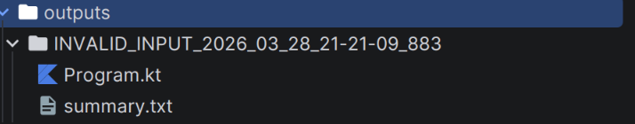

# Sample Kai Fuzzer Implementation

This codebase is made in order to fulfill a requirement from the Kotlin Foundation's
Google Summer of Code 2026 (GSoC 2026) problem statement.

[Kotlin Compiler Fuzzer (Kai) (Hard, 350 Hours)](https://kotlinlang.org/docs/gsoc-2026.html#kotlin-compiler-fuzzer-kai-hard-350-hrs)

The project consists of 5 major modules

- The Orchestrator `KaiFuzzer()`
- The Input Manager
- The System Under Test (SUT) Handler
- The Oracle
- The Issue Manager

This codebase is a library which provides the developer a very simple and elegant way to perform fuzzing on the Kotlin
compiler.

You can perform fuzzing using any Kotlin compiler version. And, the library performs differential testing, and neatly
packages the results (only for the bugs found) onto the local file system.

This project is pluggability first. Meaning, you can easily extend, write your own implementation of the major modules
and integrate them into the system seamlessly. Which is quite necessary since a lot of experimentation is involved with
fuzzing compilers.

## Example driver code

```kotlin
fun main() = runBlocking {
    println("=== Starting Sample Kai Fuzzer ===")

    val inputGenerator = SampleInputGenerator()
    val sutHandler = SampleSutHandler(
        jvmVersions = listOf("1.4.0", "1.5.0", "1.9.20", "2.1.0", "2.3.0")
    )

    val oracle = CompileOnlyOracle()
    val issueManager = SampleIssueManager()

    val fuzzer = SampleKaiFuzzer(
        inputGenerator = inputGenerator,
        sutHandler = sutHandler,
        oracle = oracle,
        issueManager = issueManager
    )

    val programsToFuzz = 5L // number of programs you want to test for the fuzzing session
    val currentJobs = 4 // Number of cores you want to allocate for the fuzzing session.

    fuzzer.run(programs = programsToFuzz, jobs = currentJobs)
    println("Fuzzing complete.")
}
```

Output of the above program

```shell
=== Starting Sample Kai Fuzzer ===
[Downloading] kotlin-compiler-embeddable 1.4.0
[Downloading] trove4j 1.0.20181211
[Downloading] kotlin-stdlib 1.4.0
[Downloading] kotlin-script-runtime 1.4.0
[Downloading] kotlin-reflect 1.4.0
[Downloading] kotlinx-coroutines-core-jvm 1.6.4
[Downloading] annotations 13.0
[Downloading] kotlin-compiler-embeddable 1.5.0
[Downloading] kotlin-stdlib 1.5.0
[Downloading] kotlin-script-runtime 1.5.0
[Downloading] kotlin-reflect 1.5.0
[Downloading] kotlin-compiler-embeddable 1.9.20
[Downloading] kotlin-stdlib 1.9.20
[Downloading] kotlin-script-runtime 1.9.20
[Downloading] kotlin-reflect 1.9.20
[Downloading] kotlin-compiler-embeddable 2.1.0
[Downloading] kotlin-stdlib 2.1.0
[Downloading] kotlin-script-runtime 2.1.0
[Downloading] kotlin-reflect 2.1.0
[Downloading] kotlin-compiler-embeddable 2.3.0
[Downloading] kotlin-stdlib 2.3.0
[Downloading] kotlin-script-runtime 2.3.0
[Downloading] kotlin-reflect 2.3.0
Fuzzing complete.

BUILD SUCCESSFUL in 1m 47s
```

---

## How to use it yourself

1. Create a new Kotlin project and use Gradle as your build system, and choose Kotlin DSL
2. Go to the `build.gradle.kts` in your project root, and make sure you add/replace these sections
```kotlin
repositories {
    mavenCentral()
    maven {
        name = "GitHubPackages"
        url = uri("https://maven.pkg.github.com/AJThePro99/sample-kai-fuzzer")
        credentials {
            username = project.findProperty("gpr.user") as String?
            password = project.findProperty("gpr.key") as String?
        }
    }
}


dependencies {
    implementation("com.aadith:sample-kai-fuzzer:0.0.1")
}
```
3. Since this library is published on GitHub packages, you'll need to create a PAT (Personal Access Token) in order to use this library
    1. Go to GitHub settings, and select `Developer Settings`
   2. There, under the Personal access tokens tab, select `Tokens (Classic`
   3. Click `Generate new token` -> `Generate new token (classic)`
   4. Select the `read:packages` scope, and click `Generate token`
   5. Immediately copy the personal access token and store it.
   6. On Linux or MacOS, you should save it in this location `~/.gradle/gradle.properties`
   ```text
   gpr.user=YOUR_GITHUB_USERNAME
   gpr.key=YOUR_PERSONAL_ACCESS_TOKEN
   ```
   On Windows, store the exact same `gradle.properties` file at this location
   ```text
      C:\Users\<YourUsername>\.gradle\gradle.properties
   ```
4. And, you're all set up. Sync the Gradle project, write your driver code, and run the compiler fuzzer

### Alternatively

You could clone this repository. Open a terminal in the root directory of the project and run this command
```shell
./gradlew publishToMavenLocal
```

And, in a fresh Kotlin project, you just need to tweak the `build.gradle.kts` file to add

```kotlin
repositories { 
    mavenCentral()
    mavenLocal() // Add this
}

dependencies {
    implementation("com.aadith:sample-kai-fuzzer:0.0.1")
}
```
And it should work the same.

---
## API Reference
<details>
  <summary>API reference for the sample-kai-fuzzer library</summary>

### 1. Input Generator

**Base Interface**: `KaiInputGenerator`

```kotlin
// Generate random Kotlin programs
val inputGenerator = SampleInputGenerator()

// Or provide specific code for deterministic testing
val inputGenerator = SingleInputGenerator(sourceCode = "fun main() { ... }")
```

**Key Method**:
- `suspend fun generateInput(): FuzzInput` - Returns a fuzz input containing source code and seed

**Data Model**:
```kotlin
data class FuzzInput(
    val id: UUID = UUID.randomUUID(),
    val sourceCode: String,
    val generatorId: String,
    val seedUsed: Long? = 0L
)
```

---

### 2. SUT Handler

**Base Interface**: `KaiSutHandler`

```kotlin
val sutHandler = SampleSutHandler(
    jvmVersions = listOf("1.4.0", "1.5.0", "1.9.20", "2.1.0", "2.3.0")
)
```

**Key Method**:
- `suspend fun executeOnCompilers(input: FuzzInput): SutResult` - Compiles input on all specified compiler versions

**Data Models**:
```kotlin
data class SutResult(
    val input: FuzzInput,
    val outputList: Map<SutBackend, List<CompilerExecutionOutput>>
)

data class CompilerExecutionOutput(
    val version: String,
    val exitCode: Int,
    val stdout: String,
    val stderr: String,
    val compiledFilePath: String? = null
)

enum class SutBackend {
    JVM, NATIVE, JS, WASM
}
```

---

### 3. Oracle

**Base Interface**: `KaiOracle`

```kotlin
// Compare compilation outputs only
val oracle = CompileOnlyOracle()

// Compare both compilation and runtime outputs
val oracle = RunnerOracle()
```

**Key Method**:
- `suspend fun evaluate(sutResult: SutResult): Verdict` - Analyzes results and delivers a verdict

**Data Models**:
```kotlin
data class Verdict(
    val result: SutResult,
    val status: VerdictStatus,
    val description: String? = null
)

enum class VerdictStatus {
    CORRECT,        // All compilations succeed and match
    BUG_FOUND,      // Compilation results across versions do not match
    INVALID_INPUT,  // All compilers fail with same error
    UNKNOWN         // Ambiguous state
}
```

---

### 4. Issue Manager

**Base Interface**: `KaiIssueManager`

```kotlin
val issueManager = SampleIssueManager(projectRoot = System.getProperty("user.dir"))
```

**Key Method**:
- `suspend fun processVerdict(verdict: Verdict)` - Handles verdict by storing bugs or cleaning up correct outputs

**Features**:
- Stores bugs found in `/outputs` directory with:
  - `Program.kt` - Source code that triggered the bug
  - `summary.txt` - Detailed verdict and compiler output
  - `output_<version>.jar` - Compiled artifacts (when applicable)
- Automatically cleans up temporary files for correct outputs

---

### 5. Orchestrator

**Base Interface**: `KaiFuzzer`

```kotlin
val fuzzer = SampleKaiFuzzer(
    inputGenerator = inputGenerator,
    sutHandler = sutHandler,
    oracle = oracle,
    issueManager = issueManager
)
```

**Key Method**:
- `suspend fun run(programs: Long, jobs: Int)` - Executes the fuzzing session
  - `programs`: Number of test cases to generate and run
  - `jobs`: Number of parallel compilation jobs


</details>
---

## What this library does

This project was built for differential testing of the Kotlin compiler across different compiler versions.
It downloads the required compilers, and runs the fuzzy generated code on the compilers for each specified version.

You can even perform specific testing. Pass in your own Kotlin code, and watch Kai take it through the entire system and deliver your results.


## Putting it to the test with a real compiler bug

To directly demonstrate the aforementioned task #4,

`How would you test the fuzzer itself? Is back-testing possible? If yes, how?
`

We shall pit the system against a real compiler bug that the original Kotlin compiler has found. And see if this system
is able to find it.

Since we can test pre-written code, it's extremely simple.
This is
the [specimen](https://youtrack.jetbrains.com/issue/KT-47891/JVM-IllegalStateException-Bad-exception-handler-end-with-nested-try-run-finally-blocks)
I will be using for this demonstration.

The affected versions are mentioned to be 1.5.21, 1.6.0-M1

Let us simulate the conditions of when the issue was found, and why don't we also test the code with a modern version (v2.3.0) to see how it looks like.
```kotlin
fun main() = runBlocking {
    println("== Start of Kai Fuzzing Session ==")
    println("Testing YouTrack Issue KT-47891")
    val inputGenerator = SingleInputGenerator(
        """
            fun box(): String {
                try {
                    try {
                        run {
                            return "OK"
                        }
                    }
                    finally {
                        return "OK"
                    }
                }
                finally {
                    return "OK"
                }
            }

            fun main() {
                println(box())
            }
        """.trimIndent()
    )

    val sutHandler = SampleSutHandler(
        jvmVersions = listOf("1.5.21", "1.6.0-M1", "2.3.0")
    )
    // Using a different oracle. This one compares both compilation outputs and
    // also compares the runtime outputs after executing the code.
    // Pluggability is this simple
    val oracle = RunnerOracle()
    val issueManager = SampleIssueManager()

    val fuzzer = SampleKaiFuzzer(
        inputGenerator = inputGenerator,
        sutHandler = sutHandler,
        oracle = oracle,
        issueManager = issueManager
    )

    fuzzer.run(programs = 1L, jobs = 1)
    println("Fuzzing Session complete")
}
```
Let's run it:

```shell
== Start of Kai Fuzzing Session ==
Testing YouTrack Issue KT-47891
[Downloading] kotlin-compiler-embeddable 1.5.21
[Downloading] kotlin-stdlib 1.5.21
[Downloading] kotlin-script-runtime 1.5.21
[Downloading] kotlin-reflect 1.5.21
[Downloading] kotlin-compiler-embeddable 1.6.0-M1
[Downloading] kotlin-stdlib 1.6.0-M1
[Downloading] kotlin-script-runtime 1.6.0-M1
[Downloading] kotlin-reflect 1.6.0-M1
Fuzzing Session complete
```
We see the creation of a new `/outputs` directory, and it seems like a new issue has been recorded.



The issue manager stores the output in a clean, readable format for future reference. In this particular session, I've
used the RunnerOracle() Which compares the compilation outputs, and also runtime outputs of the input code to test for
miscompilations. (i.e. Proper Oracle behaviour)

<details>
  <summary>Summary.txt (Warning, 350+ line stack trace)</summary>

```txt
Status: INVALID_INPUT
Description: All compilers failed to compile the input. Likely an invalid generated input.
---
Backend: JVM
    Version: 1.5.21
    Compiler exit code: 1
    Compiler stderr: 
    exception: org.jetbrains.kotlin.backend.common.BackendException: Backend Internal error: Exception during IR lowering
    File being compiled: /tmp/kotlin-1.5.21-7127837735977822343/Program.kt
    The root cause java.lang.RuntimeException was thrown at: org.jetbrains.kotlin.backend.jvm.codegen.FunctionCodegen.generate(FunctionCodegen.kt:50)
    	at org.jetbrains.kotlin.backend.common.CodegenUtil.reportBackendException(CodegenUtil.kt:239)
    	at org.jetbrains.kotlin.backend.common.CodegenUtil.reportBackendException$default(CodegenUtil.kt:235)
    	at org.jetbrains.kotlin.backend.common.phaser.PerformByIrFilePhase.invokeSequential(performByIrFile.kt:68)
    	at org.jetbrains.kotlin.backend.common.phaser.PerformByIrFilePhase.invoke(performByIrFile.kt:55)
    	at org.jetbrains.kotlin.backend.common.phaser.PerformByIrFilePhase.invoke(performByIrFile.kt:41)
    	at org.jetbrains.kotlin.backend.common.phaser.NamedCompilerPhase.invoke(CompilerPhase.kt:96)
    	at org.jetbrains.kotlin.backend.common.phaser.CompositePhase.invoke(PhaseBuilders.kt:29)
    	at org.jetbrains.kotlin.backend.common.phaser.NamedCompilerPhase.invoke(CompilerPhase.kt:96)
    	at org.jetbrains.kotlin.backend.common.phaser.CompositePhase.invoke(PhaseBuilders.kt:29)
    	at org.jetbrains.kotlin.backend.common.phaser.NamedCompilerPhase.invoke(CompilerPhase.kt:96)
    	at org.jetbrains.kotlin.backend.common.phaser.CompilerPhaseKt.invokeToplevel(CompilerPhase.kt:43)
    	at org.jetbrains.kotlin.backend.jvm.JvmIrCodegenFactory.doGenerateFilesInternal(JvmIrCodegenFactory.kt:191)
    	at org.jetbrains.kotlin.backend.jvm.JvmIrCodegenFactory.generateModule(JvmIrCodegenFactory.kt:60)
    	at org.jetbrains.kotlin.codegen.KotlinCodegenFacade.compileCorrectFiles(KotlinCodegenFacade.java:35)
    	at org.jetbrains.kotlin.cli.jvm.compiler.KotlinToJVMBytecodeCompiler.generate(KotlinToJVMBytecodeCompiler.kt:618)
    	at org.jetbrains.kotlin.cli.jvm.compiler.KotlinToJVMBytecodeCompiler.compileModules$cli(KotlinToJVMBytecodeCompiler.kt:211)
    	at org.jetbrains.kotlin.cli.jvm.compiler.KotlinToJVMBytecodeCompiler.compileModules$cli$default(KotlinToJVMBytecodeCompiler.kt:154)
    	at org.jetbrains.kotlin.cli.jvm.K2JVMCompiler.doExecute(K2JVMCompiler.kt:169)
    	at org.jetbrains.kotlin.cli.jvm.K2JVMCompiler.doExecute(K2JVMCompiler.kt:52)
    	at org.jetbrains.kotlin.cli.common.CLICompiler.execImpl(CLICompiler.kt:90)
    	at org.jetbrains.kotlin.cli.common.CLICompiler.execImpl(CLICompiler.kt:44)
    	at org.jetbrains.kotlin.cli.common.CLITool.exec(CLITool.kt:98)
    	at org.jetbrains.kotlin.cli.common.CLITool.exec(CLITool.kt:76)
    	at org.jetbrains.kotlin.cli.common.CLITool.exec(CLITool.kt:45)
    	at org.jetbrains.kotlin.cli.common.CLITool$Companion.doMainNoExit(CLITool.kt:227)
    	at org.jetbrains.kotlin.cli.common.CLITool$Companion.doMainNoExit$default(CLITool.kt:222)
    	at org.jetbrains.kotlin.cli.common.CLITool$Companion.doMain(CLITool.kt:214)
    	at org.jetbrains.kotlin.cli.jvm.K2JVMCompiler$Companion.main(K2JVMCompiler.kt:271)
    	at org.jetbrains.kotlin.cli.jvm.K2JVMCompiler.main(K2JVMCompiler.kt)
    Caused by: java.lang.RuntimeException: Exception while generating code for:
    FUN name:box visibility:public modality:FINAL <> () returnType:kotlin.String
      BLOCK_BODY
        TRY type=kotlin.Unit
          try: BLOCK type=kotlin.Unit origin=null
            TRY type=kotlin.Unit
              try: BLOCK type=kotlin.Unit origin=null
                BLOCK type=kotlin.Nothing origin=null
                  CALL 'public final fun run <R> (block: kotlin.Function0<R of kotlin.StandardKt.run>): R of kotlin.StandardKt.run [inline] declared in kotlin.StandardKt' type=kotlin.Nothing origin=null
                    <R>: kotlin.Nothing
                    block: BLOCK type=kotlin.Function0<kotlin.Nothing> origin=LAMBDA
                      COMPOSITE type=kotlin.Unit origin=null
                      FUNCTION_REFERENCE 'private final fun box$lambda-0 (): kotlin.Nothing declared in <root>.ProgramKt' type=kotlin.Function0<kotlin.Nothing> origin=LAMBDA reflectionTarget=null
                  CALL 'public final fun throwKotlinNothingValueException (): kotlin.Nothing declared in kotlin.jvm.internal.Intrinsics' type=kotlin.Nothing origin=null
              finally: BLOCK type=kotlin.Unit origin=null
                RETURN type=kotlin.Nothing from='public final fun box (): kotlin.String declared in <root>.ProgramKt'
                  CONST String type=kotlin.String value="OK"
          finally: BLOCK type=kotlin.Unit origin=null
            RETURN type=kotlin.Nothing from='public final fun box (): kotlin.String declared in <root>.ProgramKt'
              CONST String type=kotlin.String value="OK"
    
    	at org.jetbrains.kotlin.backend.jvm.codegen.FunctionCodegen.generate(FunctionCodegen.kt:50)
    	at org.jetbrains.kotlin.backend.jvm.codegen.FunctionCodegen.generate$default(FunctionCodegen.kt:43)
    	at org.jetbrains.kotlin.backend.jvm.codegen.ClassCodegen.generateMethodNode(ClassCodegen.kt:349)
    	at org.jetbrains.kotlin.backend.jvm.codegen.ClassCodegen.generateMethod(ClassCodegen.kt:366)
    	at org.jetbrains.kotlin.backend.jvm.codegen.ClassCodegen.generate(ClassCodegen.kt:133)
    	at org.jetbrains.kotlin.backend.jvm.JvmLowerKt$codegenPhase$1$1.lower(JvmLower.kt:304)
    	at org.jetbrains.kotlin.backend.common.phaser.FileLoweringPhaseAdapter.invoke(PhaseBuilders.kt:120)
    	at org.jetbrains.kotlin.backend.common.phaser.FileLoweringPhaseAdapter.invoke(PhaseBuilders.kt:116)
    	at org.jetbrains.kotlin.backend.common.phaser.NamedCompilerPhase.invoke(CompilerPhase.kt:96)
    	at org.jetbrains.kotlin.backend.common.phaser.PerformByIrFilePhase.invokeSequential(performByIrFile.kt:65)
    	... 26 more
    Caused by: java.lang.IllegalStateException: Bad exception handler end
    	at org.jetbrains.kotlin.codegen.inline.MaxStackFrameSizeAndLocalsCalculator.visitMaxs(MaxStackFrameSizeAndLocalsCalculator.java:320)
    	at org.jetbrains.kotlin.backend.jvm.codegen.FunctionCodegen.doGenerate(FunctionCodegen.kt:126)
    	at org.jetbrains.kotlin.backend.jvm.codegen.FunctionCodegen.generate(FunctionCodegen.kt:48)
    	... 35 more
    
    

    Version: 1.6.0-M1
    Compiler exit code: 1
    Compiler stderr: 
    exception: org.jetbrains.kotlin.backend.common.BackendException: Backend Internal error: Exception during IR lowering
    File being compiled: /tmp/kotlin-1.6.0-M1-3352237671363673062/Program.kt
    The root cause java.lang.RuntimeException was thrown at: org.jetbrains.kotlin.backend.jvm.codegen.FunctionCodegen.generate(FunctionCodegen.kt:50)
    	at org.jetbrains.kotlin.backend.common.CodegenUtil.reportBackendException(CodegenUtil.kt:239)
    	at org.jetbrains.kotlin.backend.common.CodegenUtil.reportBackendException$default(CodegenUtil.kt:235)
    	at org.jetbrains.kotlin.backend.common.phaser.PerformByIrFilePhase.invokeSequential(performByIrFile.kt:68)
    	at org.jetbrains.kotlin.backend.common.phaser.PerformByIrFilePhase.invoke(performByIrFile.kt:55)
    	at org.jetbrains.kotlin.backend.common.phaser.PerformByIrFilePhase.invoke(performByIrFile.kt:41)
    	at org.jetbrains.kotlin.backend.common.phaser.NamedCompilerPhase.invoke(CompilerPhase.kt:96)
    	at org.jetbrains.kotlin.backend.common.phaser.CompositePhase.invoke(PhaseBuilders.kt:29)
    	at org.jetbrains.kotlin.backend.common.phaser.NamedCompilerPhase.invoke(CompilerPhase.kt:96)
    	at org.jetbrains.kotlin.backend.common.phaser.CompositePhase.invoke(PhaseBuilders.kt:29)
    	at org.jetbrains.kotlin.backend.common.phaser.NamedCompilerPhase.invoke(CompilerPhase.kt:96)
    	at org.jetbrains.kotlin.backend.common.phaser.CompilerPhaseKt.invokeToplevel(CompilerPhase.kt:43)
    	at org.jetbrains.kotlin.backend.jvm.JvmIrCodegenFactory.doGenerateFilesInternal(JvmIrCodegenFactory.kt:193)
    	at org.jetbrains.kotlin.backend.jvm.JvmIrCodegenFactory.generateModule(JvmIrCodegenFactory.kt:60)
    	at org.jetbrains.kotlin.codegen.KotlinCodegenFacade.compileCorrectFiles(KotlinCodegenFacade.java:35)
    	at org.jetbrains.kotlin.cli.jvm.compiler.KotlinToJVMBytecodeCompiler.generate(KotlinToJVMBytecodeCompiler.kt:333)
    	at org.jetbrains.kotlin.cli.jvm.compiler.KotlinToJVMBytecodeCompiler.compileModules$cli(KotlinToJVMBytecodeCompiler.kt:125)
    	at org.jetbrains.kotlin.cli.jvm.compiler.KotlinToJVMBytecodeCompiler.compileModules$cli$default(KotlinToJVMBytecodeCompiler.kt:60)
    	at org.jetbrains.kotlin.cli.jvm.K2JVMCompiler.doExecute(K2JVMCompiler.kt:170)
    	at org.jetbrains.kotlin.cli.jvm.K2JVMCompiler.doExecute(K2JVMCompiler.kt:52)
    	at org.jetbrains.kotlin.cli.common.CLICompiler.execImpl(CLICompiler.kt:92)
    	at org.jetbrains.kotlin.cli.common.CLICompiler.execImpl(CLICompiler.kt:44)
    	at org.jetbrains.kotlin.cli.common.CLITool.exec(CLITool.kt:98)
    	at org.jetbrains.kotlin.cli.common.CLITool.exec(CLITool.kt:76)
    	at org.jetbrains.kotlin.cli.common.CLITool.exec(CLITool.kt:45)
    	at org.jetbrains.kotlin.cli.common.CLITool$Companion.doMainNoExit(CLITool.kt:227)
    	at org.jetbrains.kotlin.cli.common.CLITool$Companion.doMainNoExit$default(CLITool.kt:225)
    	at org.jetbrains.kotlin.cli.common.CLITool$Companion.doMain(CLITool.kt:214)
    	at org.jetbrains.kotlin.cli.jvm.K2JVMCompiler$Companion.main(K2JVMCompiler.kt:272)
    	at org.jetbrains.kotlin.cli.jvm.K2JVMCompiler.main(K2JVMCompiler.kt)
    Caused by: java.lang.RuntimeException: Exception while generating code for:
    FUN name:box visibility:public modality:FINAL <> () returnType:kotlin.String
      BLOCK_BODY
        TRY type=kotlin.Unit
          try: BLOCK type=kotlin.Unit origin=null
            TRY type=kotlin.Unit
              try: BLOCK type=kotlin.Unit origin=null
                BLOCK type=kotlin.Nothing origin=null
                  CALL 'public final fun run <R> (block: kotlin.Function0<R of kotlin.StandardKt.run>): R of kotlin.StandardKt.run [inline] declared in kotlin.StandardKt' type=kotlin.Nothing origin=null
                    <R>: kotlin.Nothing
                    block: BLOCK type=kotlin.Function0<kotlin.Nothing> origin=LAMBDA
                      COMPOSITE type=kotlin.Unit origin=null
                      FUNCTION_REFERENCE 'private final fun box$lambda-0 (): kotlin.Nothing declared in <root>.ProgramKt' type=kotlin.Function0<kotlin.Nothing> origin=LAMBDA reflectionTarget=null
                  CALL 'public final fun throwKotlinNothingValueException (): kotlin.Nothing declared in kotlin.jvm.internal.Intrinsics' type=kotlin.Nothing origin=null
              finally: BLOCK type=kotlin.Unit origin=null
                RETURN type=kotlin.Nothing from='public final fun box (): kotlin.String declared in <root>.ProgramKt'
                  CONST String type=kotlin.String value="OK"
          finally: BLOCK type=kotlin.Unit origin=null
            RETURN type=kotlin.Nothing from='public final fun box (): kotlin.String declared in <root>.ProgramKt'
              CONST String type=kotlin.String value="OK"
    
    	at org.jetbrains.kotlin.backend.jvm.codegen.FunctionCodegen.generate(FunctionCodegen.kt:50)
    	at org.jetbrains.kotlin.backend.jvm.codegen.FunctionCodegen.generate$default(FunctionCodegen.kt:43)
    	at org.jetbrains.kotlin.backend.jvm.codegen.ClassCodegen.generateMethodNode(ClassCodegen.kt:361)
    	at org.jetbrains.kotlin.backend.jvm.codegen.ClassCodegen.generateMethod(ClassCodegen.kt:378)
    	at org.jetbrains.kotlin.backend.jvm.codegen.ClassCodegen.generate(ClassCodegen.kt:132)
    	at org.jetbrains.kotlin.backend.jvm.JvmLowerKt$codegenPhase$1$1.lower(JvmLower.kt:303)
    	at org.jetbrains.kotlin.backend.common.phaser.FileLoweringPhaseAdapter.invoke(PhaseBuilders.kt:120)
    	at org.jetbrains.kotlin.backend.common.phaser.FileLoweringPhaseAdapter.invoke(PhaseBuilders.kt:116)
    	at org.jetbrains.kotlin.backend.common.phaser.NamedCompilerPhase.invoke(CompilerPhase.kt:96)
    	at org.jetbrains.kotlin.backend.common.phaser.PerformByIrFilePhase.invokeSequential(performByIrFile.kt:65)
    	... 26 more
    Caused by: java.lang.IllegalStateException: Bad exception handler end
    	at org.jetbrains.kotlin.codegen.inline.MaxStackFrameSizeAndLocalsCalculator.visitMaxs(MaxStackFrameSizeAndLocalsCalculator.java:320)
    	at org.jetbrains.kotlin.backend.jvm.codegen.FunctionCodegen.doGenerate(FunctionCodegen.kt:126)
    	at org.jetbrains.kotlin.backend.jvm.codegen.FunctionCodegen.generate(FunctionCodegen.kt:48)
    	... 35 more
    
    

    Version: 2.3.0
    Compiler exit code: 1
    Compiler stderr: 
    exception: org.jetbrains.kotlin.codegen.CompilationException: Back-end (JVM) Internal error: Couldn't transform method node:
    box ()Ljava/lang/String;:
      @Lorg/jetbrains/annotations/NotNull;() // invisible
        TRYCATCHBLOCK L0 L1 L2 null
        TRYCATCHBLOCK L3 L4 L2 null
        TRYCATCHBLOCK L5 L6 L2 null
        TRYCATCHBLOCK L7 L8 L9 null
        TRYCATCHBLOCK L10 L11 L9 null
        TRYCATCHBLOCK L3 L12 L9 null
        TRYCATCHBLOCK L13 L14 L9 null
        TRYCATCHBLOCK L15 L16 L9 null
        TRYCATCHBLOCK L17 L18 L9 null
       L19
        LINENUMBER 2 L19
       L7
        NOP
       L20
        LINENUMBER 3 L20
       L0
        NOP
       L21
        LINENUMBER 4 L21
        NOP
       L22
        NOP
        INVOKESTATIC kotlin/jvm/internal/InlineMarker.beforeInlineCall ()V
       L23
        ICONST_0
        ISTORE 0
       L24
        LINENUMBER 5 L24
        LDC "OK"
       L25
        ASTORE 1
       L1
        LINENUMBER 9 L1
        LDC "OK"
        ASTORE 2
       L8
        LINENUMBER 13 L8
        LDC "OK"
        ARETURN
       L26
        NOP
       L27
        ALOAD 2
       L28
        LINENUMBER 9 L28
        ARETURN
       L29
        NOP
       L30
        LINENUMBER 13 L30
        LDC "OK"
        ARETURN
       L31
        NOP
       L32
        ALOAD 1
        ARETURN
       L3
        INVOKESTATIC kotlin/jvm/internal/InlineMarker.afterInlineCall ()V
       L33
        LINENUMBER 4 L33
        NOP
        GOTO L34
       L34
        POP
       L35
        LINENUMBER 4 L35
        NEW kotlin/KotlinNothingValueException
        DUP
        INVOKESPECIAL kotlin/KotlinNothingValueException.<init> ()V
        ATHROW
        ASTORE 0
       L36
        LINENUMBER 9 L36
        LDC "OK"
        ASTORE 1
       L12
        LINENUMBER 13 L12
        LDC "OK"
        ARETURN
       L37
        NOP
       L38
        ALOAD 1
       L39
        LINENUMBER 9 L39
        ARETURN
       L13
        NOP
       L40
        LINENUMBER 10 L40
        GOTO L41
       L5
        LINENUMBER 9 L5
        ASTORE 1
       L6
        LDC "OK"
        ASTORE 2
       L14
        LINENUMBER 13 L14
        LDC "OK"
        ARETURN
       L42
        NOP
       L43
        ALOAD 2
       L44
        LINENUMBER 9 L44
        ARETURN
       L15
        NOP
       L45
        ALOAD 1
        ATHROW
       L41
        ALOAD 0
        ASTORE 0
       L46
        LINENUMBER 13 L46
        LDC "OK"
        ARETURN
       L47
        NOP
       L48
        LINENUMBER 14 L48
        GOTO L49
       L17
        LINENUMBER 13 L17
        ASTORE 1
       L18
        LDC "OK"
        ARETURN
       L50
        NOP
       L51
        ALOAD 1
        ATHROW
       L49
        LINENUMBER 15 L49
        NOP
        ACONST_NULL
        ARETURN
       L52
        LOCALVARIABLE $i$a$-run-ProgramKt$box$1 I L24 L25 0
        MAXSTACK = 1
        MAXLOCALS = 3
    
    File is unknown
    The root cause java.lang.IllegalStateException was thrown at: org.jetbrains.kotlin.codegen.optimization.LabelNormalizationMethodTransformer$TransformerForMethod.getNew(LabelNormalizationMethodTransformer.kt:149)
    	at org.jetbrains.kotlin.codegen.TransformationMethodVisitor.visitEnd(TransformationMethodVisitor.kt:89)
    	at org.jetbrains.org.objectweb.asm.MethodVisitor.visitEnd(MethodVisitor.java:796)
    	at org.jetbrains.org.objectweb.asm.tree.MethodNode.accept(MethodNode.java:770)
    	at org.jetbrains.kotlin.backend.jvm.codegen.ClassCodegen.generateMethod(ClassCodegen.kt:476)
    	at org.jetbrains.kotlin.backend.jvm.codegen.ClassCodegen.generate(ClassCodegen.kt:168)
    	at org.jetbrains.kotlin.backend.jvm.JvmIrCodegenFactory.generateFile(JvmIrCodegenFactory.kt:467)
    	at org.jetbrains.kotlin.backend.jvm.JvmIrCodegenFactory.invokeCodegen(JvmIrCodegenFactory.kt:433)
    	at org.jetbrains.kotlin.cli.jvm.compiler.KotlinToJVMBytecodeCompiler.runCodegen$cli(KotlinToJVMBytecodeCompiler.kt:409)
    	at org.jetbrains.kotlin.cli.pipeline.jvm.JvmBackendPipelinePhase.executePhase(JvmBackendPipelinePhase.kt:89)
    	at org.jetbrains.kotlin.cli.pipeline.jvm.JvmBackendPipelinePhase.executePhase(JvmBackendPipelinePhase.kt:27)
    	at org.jetbrains.kotlin.cli.pipeline.PipelinePhase.phaseBody(PipelinePhase.kt:68)
    	at org.jetbrains.kotlin.cli.pipeline.PipelinePhase.phaseBody(PipelinePhase.kt:58)
    	at org.jetbrains.kotlin.config.phaser.NamedCompilerPhase.invoke(CompilerPhase.kt:102)
    	at org.jetbrains.kotlin.backend.common.phaser.CompositePhase.invoke(PhaseBuilders.kt:22)
    	at org.jetbrains.kotlin.config.phaser.CompilerPhaseKt.invokeToplevel(CompilerPhase.kt:53)
    	at org.jetbrains.kotlin.cli.pipeline.AbstractCliPipeline.runPhasedPipeline(AbstractCliPipeline.kt:109)
    	at org.jetbrains.kotlin.cli.pipeline.AbstractCliPipeline.execute(AbstractCliPipeline.kt:68)
    	at org.jetbrains.kotlin.cli.jvm.K2JVMCompiler.doExecutePhased(K2JVMCompiler.kt:51)
    	at org.jetbrains.kotlin.cli.jvm.K2JVMCompiler.doExecutePhased(K2JVMCompiler.kt:42)
    	at org.jetbrains.kotlin.cli.common.CLICompiler.execImpl(CLICompiler.kt:89)
    	at org.jetbrains.kotlin.cli.common.CLICompiler.exec(CLICompiler.kt:359)
    	at org.jetbrains.kotlin.cli.common.CLICompiler.exec(CLICompiler.kt:337)
    	at org.jetbrains.kotlin.cli.common.CLICompiler.exec(CLICompiler.kt:301)
    	at org.jetbrains.kotlin.cli.common.CLICompiler$Companion.doMainNoExit(CLICompiler.kt:438)
    	at org.jetbrains.kotlin.cli.common.CLICompiler$Companion.doMainNoExit$default(CLICompiler.kt:433)
    	at org.jetbrains.kotlin.cli.common.CLICompiler$Companion.doMain(CLICompiler.kt:425)
    	at org.jetbrains.kotlin.cli.jvm.K2JVMCompiler$Companion.main(K2JVMCompiler.kt:231)
    	at org.jetbrains.kotlin.cli.jvm.K2JVMCompiler.main(K2JVMCompiler.kt)
    Caused by: java.lang.IllegalStateException: Label wasn't found during iterating through instructions
    	at org.jetbrains.kotlin.codegen.optimization.LabelNormalizationMethodTransformer$TransformerForMethod.getNew(LabelNormalizationMethodTransformer.kt:149)
    	at org.jetbrains.kotlin.codegen.optimization.LabelNormalizationMethodTransformer$TransformerForMethod.rewriteTryCatchBlocks(LabelNormalizationMethodTransformer.kt:102)
    	at org.jetbrains.kotlin.codegen.optimization.LabelNormalizationMethodTransformer$TransformerForMethod.transform(LabelNormalizationMethodTransformer.kt:38)
    	at org.jetbrains.kotlin.codegen.optimization.LabelNormalizationMethodTransformer.transform(LabelNormalizationMethodTransformer.kt:28)
    	at org.jetbrains.kotlin.codegen.optimization.transformer.CompositeMethodTransformer.transform(CompositeMethodTransformer.kt:25)
    	at org.jetbrains.kotlin.codegen.optimization.transformer.CompositeMethodTransformer.transform(CompositeMethodTransformer.kt:25)
    	at org.jetbrains.kotlin.codegen.optimization.OptimizationMethodVisitor.performTransformations(OptimizationMethodVisitor.kt:70)
    	at org.jetbrains.kotlin.codegen.TransformationMethodVisitor.visitEnd(TransformationMethodVisitor.kt:67)
    	... 27 more
```

</details>

After execution, you see identical compiler errors for the versions it was diagnosed on.
And, we were able to so effortlessly test it on the `v2.3.0` compiler. You just needed to add the compiler version to the list. As simple as that.

Since the [KT-47891](https://youtrack.jetbrains.com/issue/KT-47891/JVM-IllegalStateException-Bad-exception-handler-end-with-nested-try-run-finally-blocks) issue is still open and not resolved, an error pops up in the modern compiler version as well.

## Limitations

- This is a simple proof of concept for my proposal. It does not implement the sophisticated input generator algorithms to generate mutated code yet.
- It demonstrates pluggability and clean architecture the best. But, File IO in the `SampleIssueManager()` currently hardcodes output paths to the project root. For production, this module will adhere to stricter protocols to make it safer and give more options to the user.
- There is a proposal to extend this fuzzer to support all Kotlin backends (JVM, Native, JS, WASM). After the JVM backend support is stable, work for the other backends will begin.
--- 

## Next Steps for this repository

- [ ] Introduce new CLI UI using [mordant](https://github.com/ajalt/mordant), for better understanding of the ongoing process
